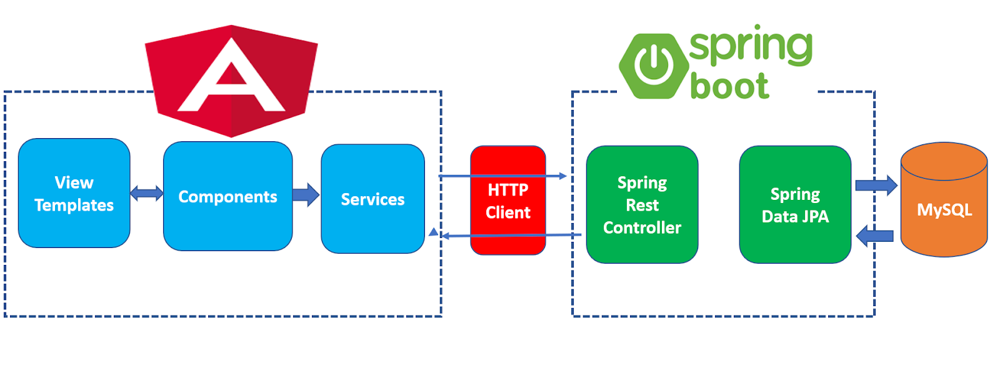
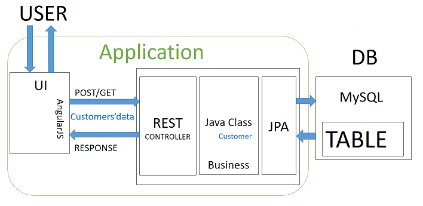
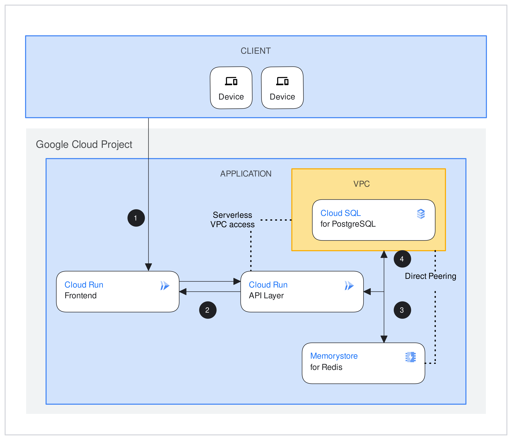

## SOFTWARE ENGINEERING CAPSTONE
Welcome to Software Engineering Capstone! This is an opportunity for students to develop full stack software engineering documentation and applications. They will execute documentation, unit testing, revision of software applications, and deploy software applications with scripts and containers on a cloud platform.

Sure! Here’s a template for a README file for your e-commerce application. You can customize it based on your specific project details.

---

# E-Commerce Application

## Overview

This e-commerce fullstack application is designed to provide a seamless shopping experience. It is built with Angular for the front-end and Java Spring Boot for the back-end. The application supports user registration, product browsing, shopping cart management, and order processing.

## Design Diagram



## Architecture Diagram




## Features

- **User Authentication**: Register and log in to manage your account.
- **Product Catalog**: Browse and search for products.
- **Shopping Cart**: Add items to your cart and view cart details.
- **Checkout**: Complete your purchase with various payment options.
- **Order History**: View past orders and track their status.

## Technologies Used

- **Front-End**: Angular
- **Back-End**: Java Spring Boot
- **Database**: MySQL
- **Other Tools**: Docker (for containerization), Maven (for build automation)
- **Deployment**: Google Cloud (Cloud Sql, Cloud Run)

## Google Cloud Deployment Overview
This project is deployed using Google Cloud Run for the backend and frontend services, with Cloud SQL providing database support. The deployment is designed to be scalable, secure, and cost-efficient.

## Backend - Java Spring Boot Application
The backend service, built using Java Spring Boot, is deployed in Google Cloud Run.
The application connects to a Cloud SQL instance for data persistence.
Communication between the backend service and Cloud SQL is secured using a VPC Serverless Connector, ensuring the database remains private while still accessible to the application.

## Frontend - Angular Application
The frontend is an Angular web application, also deployed using Google Cloud Run.
It serves as the user interface for interacting with the backend services and database.
The frontend communicates with the backend API via RESTful endpoints exposed by the Java Spring Boot service.

## Cloud SQL
The database is managed using Google Cloud SQL (MySQL).
A VPC Serverless Connector links the backend service to the Cloud SQL instance securely.
The database is private, ensuring it is not exposed to external networks.

## Networking
Both the backend and frontend services are connected using a VPC Serverless Connector, which allows secure communication between services and the Cloud SQL instance.
The setup ensures a highly secure architecture where services can scale independently without exposing the database to the public internet.

## CI/CD
For continuous deployment, each service is containerized using Docker, and images are pushed to Google Container Registry (GCR).
Google Cloud Build or other CI/CD tools can be used to automate the deployment process, ensuring fast and reliable updates.

## Security & Monitoring
Google Cloud IAM (Identity and Access Management) is used to secure access to various cloud resources.
Monitoring and logging are handled by Google Cloud Monitoring and Cloud Logging, ensuring visibility into application performance and operational health.

## Application Deployment Diagram


## Installation

### Prerequisites

- Java 11 or later
- Node.js and npm
- Docker (optional, for containerization)

### Clone the Repository
### Set Up the Back-End

1. **Navigate to the back-end directory**:

    ```bash
    cd backend
    ```

2. **Install dependencies**:

    ```bash
    ./gradlew build
    ```

3. **Run the back-end application**:

    ```bash
    ./gradlew bootRun
    ```

### Set Up the Front-End

1. **Navigate to the front-end directory**:

    ```bash
    cd frontend
    ```

2. **Install dependencies**:

    ```bash
    npm install
    ```

3. **Run the front-end application**:

    ```bash
    ng serve
    ```

### Docker Setup (Optional)

1. **Build the Docker image**:

    ```bash
    docker build -t your-app-name .
    ```

2. **Run the Docker container**:

    ```bash
    docker run -p 8080:8080 app-name
    ```

## Usage

1. **Access the Application**: Open your browser and go to `http://localhost:4200` to view the front-end application. The back-end API will be available at `http://localhost:8080`.

2. **Create an Account**: Register a new account to start shopping.

3. **Browse Products**: Use the search functionality or browse through categories.

4. **Add to Cart**: Add items to your shopping cart and view the cart summary.

5. **Checkout**: Proceed to checkout and complete your purchase.

6. **Manage Your Account**: Update your profile and view your order history.


---
